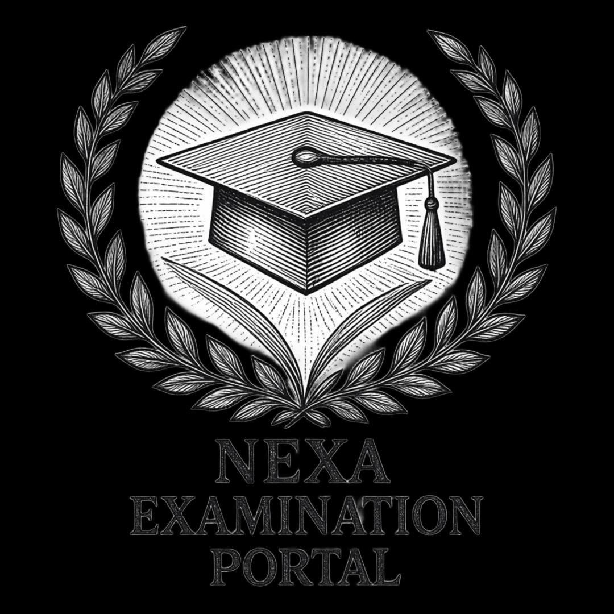
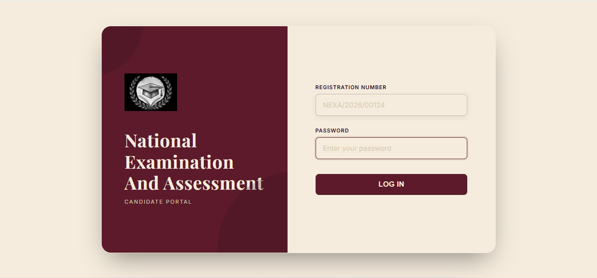
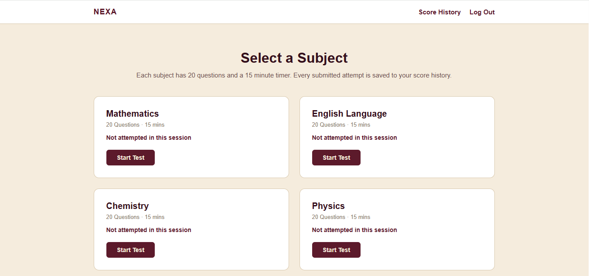
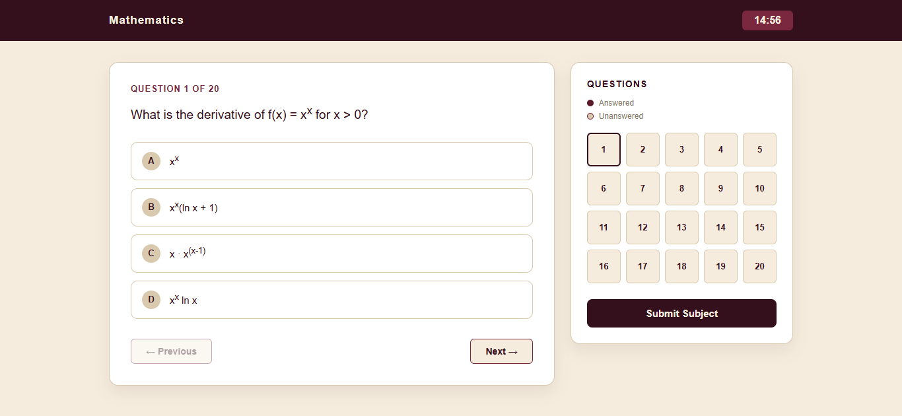
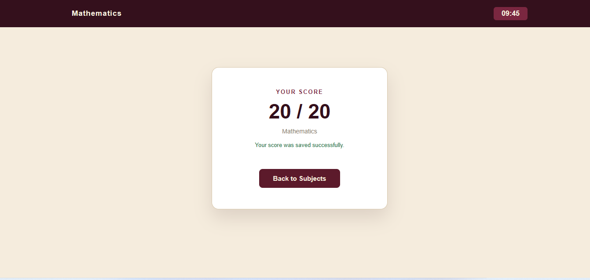
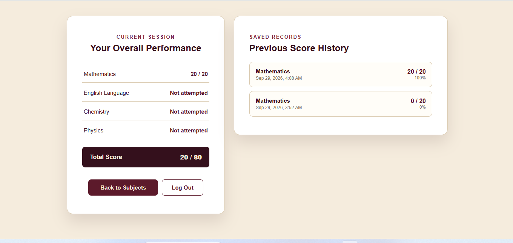

# NEXA Computer-Based Test (CBT) Candidate Portal

<p align="center">
  
</p>

NEXA is a responsive computer-based testing website where candidates can sign in with their registration number, read the examination instructions, select a subject, take a timed multiple-choice test, and review their previous scores.

The project uses Firebase Authentication to verify candidates and Cloud Firestore to save each candidate's examination attempts securely under their Firebase user ID.

> **Project status:** Learning and portfolio project. It is not yet suitable for a real high-stakes examination because questions, correct answers, and score calculation are currently handled in the browser.

## Main features

- Candidate sign-in using a registration number and password
- Firebase Email/Password Authentication
- Protected candidate-only pages
- Four available subjects: Mathematics, English Language, Chemistry, and Physics
- 20 multiple-choice questions per subject
- 15-minute countdown timer for each subject
- Previous and next question navigation
- Question-number navigation with answered-question indicators
- Warning before submitting with unanswered questions
- Automatic submission when the timer reaches zero
- Automatic score calculation
- Score storage in Cloud Firestore
- Candidate-specific score history
- Current-session overall result out of 80
- Sign-out functionality
- Responsive interface for desktop and smaller screens

## Screenshots

### Candidate login



### Subject selection



### Timed examination interface



### Submitted score



### Current performance and previous score history



## Candidate journey

1. The candidate opens the NEXA welcome page.
2. The candidate signs in with a valid registration number and password.
3. The candidate reads the examination instructions.
4. The candidate selects a subject.
5. The candidate completes a timed 20-question test.
6. The website calculates and displays the score.
7. The attempt is saved in Cloud Firestore.
8. The candidate can open the results page to view previous attempts.

## Technologies used

- HTML5
- CSS3
- Vanilla JavaScript (ES modules)
- Firebase Authentication
- Cloud Firestore
- Firebase JavaScript SDK loaded through browser imports

No framework, package manager, or build step is required.

## Project structure

```text
firebase-ready-cbt/
├── image/
│   └── logo.png.jpeg        # NEXA logo
├── screenshots/             # Screenshots displayed in this README
├── index.html               # Welcome page
├── login.html               # Candidate login page
├── intr.html                # Examination instructions
├── subjects.html            # Subject selection page
├── exam.html                # Timed examination page
├── results.html             # Current results and saved score history
├── firebase-config.js       # Firebase web-app configuration
├── auth-guard.js            # Authentication checks and sign-out logic
├── login.js                 # Candidate login logic
├── subjects.js              # Subject cards and session scores
├── exam-data.js             # Questions, answer choices, and correct answers
├── exam.js                  # Timer, navigation, marking, and score saving
├── results.js               # Current results and Firestore history
├── firestore.rules          # Firestore security rules
├── FIREBASE-SETUP.txt       # Short Firebase setup checklist
└── *.css                    # Styling for the website pages
```

## Firebase data structure

Every submitted attempt is stored under the authenticated candidate's Firebase user ID:

```text
candidates
└── {candidateId}
    └── scores
        └── {scoreId}
            ├── candidateId
            ├── registrationNumber
            ├── subjectSlug
            ├── subjectName
            ├── score
            ├── totalQuestions
            ├── percentage
            └── submittedAt
```

Example score document:

```text
registrationNumber: "NEXA/2026/00124"
subjectName: "Mathematics"
subjectSlug: "maths"
score: 15
totalQuestions: 20
percentage: 75
submittedAt: Firestore server timestamp
```

## Run the project locally

### 1. Download or clone the project

```bash
git clone https://github.com/YOUR-USERNAME/nexa-cbt-portal.git
cd nexa-cbt-portal
```

Replace `YOUR-USERNAME` with the GitHub username that owns the repository.

### 2. Create a Firebase project

1. Open the [Firebase Console](https://console.firebase.google.com/).
2. Create a project or select an existing project.
3. Open **Project settings**.
4. Under **Your apps**, register a Web app using the `</>` icon.
5. Copy the `firebaseConfig` object displayed by Firebase.

### 3. Connect the website to Firebase

Open `firebase-config.js` and replace the placeholder values:

```javascript
const firebaseConfig = {
  apiKey: "PASTE_YOUR_API_KEY",
  authDomain: "PASTE_YOUR_AUTH_DOMAIN",
  projectId: "PASTE_YOUR_PROJECT_ID",
  storageBucket: "PASTE_YOUR_STORAGE_BUCKET",
  messagingSenderId: "PASTE_YOUR_MESSAGING_SENDER_ID",
  appId: "PASTE_YOUR_APP_ID"
};
```

Use the values supplied for your own Firebase Web app. Never add a Firebase Admin SDK service-account file or private key to this frontend project.

### 4. Enable candidate authentication

1. In Firebase Console, open **Authentication**.
2. Open **Sign-in method**.
3. Enable **Email/Password**.
4. Open the **Users** tab and create candidate accounts.

The login page converts a registration number into an internal Firebase email. For example:

```text
Registration number: NEXA/2026/00124
Internal email:      nexa202600124@nexa.test
```

Choose strong, unique passwords. Do not publish candidate passwords in the repository.

### 5. Create Cloud Firestore

1. In Firebase Console, open **Firestore**.
2. Click **Create database**.
3. Select **Production mode**.
4. Select an appropriate database location.
5. Create the database.

### 6. Publish the security rules

1. Open **Firestore > Rules**.
2. Copy the contents of `firestore.rules`.
3. Replace the rules in Firebase with the copied rules.
4. Click **Publish**.

The included rules allow an authenticated candidate to read and create score records only inside their own user-ID path. Submitted results cannot be updated or deleted from the website.

### 7. Start a local web server

Firebase browser modules should be served through HTTP. Do not test the project by double-clicking `index.html`.

Using VS Code:

1. Install the **Live Server** extension.
2. Open the project folder in VS Code.
3. Right-click `index.html`.
4. Select **Open with Live Server**.

If Firebase rejects the local domain, add `localhost` under **Firebase Authentication > Settings > Authorized domains**.

## Testing the complete flow

1. Open the website with Live Server.
2. Click **Login**.
3. Enter a candidate registration number and password that exists in Firebase Authentication.
4. Read the instructions and proceed to the subject page.
5. Select a subject and answer some questions.
6. Submit the subject.
7. Confirm that the page says the score was saved successfully.
8. Open **Results & Previous Scores** and confirm the attempt appears.
9. In Firebase Console, open **Firestore > Data**.
10. Follow `candidates > candidate UID > scores > score document` to inspect the saved result.

## Optional GitHub Pages deployment

Because this is a static frontend, it can be published with GitHub Pages:

1. Open the repository on GitHub.
2. Select **Settings > Pages**.
3. Under **Build and deployment**, select **Deploy from a branch**.
4. Select the `main` branch and the `/ (root)` folder.
5. Click **Save**.
6. Wait for GitHub to display the website URL.
7. Add only the domain portion, such as `YOUR-USERNAME.github.io`, to **Firebase Authentication > Settings > Authorized domains**.

The usual project-site address is:

```text
https://YOUR-USERNAME.github.io/nexa-cbt-portal/
```

## Security notes

- Never commit candidate passwords, private keys, service-account JSON files, or Firebase Admin SDK credentials.
- A Firebase Web API key is part of the public client configuration; it does not replace Authentication and Firestore Security Rules.
- Keep the Firestore rules in production mode and test them carefully.
- The current correct answers are visible in `exam-data.js` and score calculation occurs in `exam.js`. This is acceptable only for a demonstration or learning project.
- For a real examination, keep the question bank and marking logic on a trusted server, such as a Firebase Cloud Function, and return only the final result to the browser.
- Consider enabling Firebase App Check before using the project publicly.

## Current limitations

- Candidate accounts must be created manually in Firebase Authentication.
- There is no administrator dashboard.
- Questions and answers are stored in browser JavaScript.
- Scores are calculated in the browser and can be manipulated by a knowledgeable user.
- The current-session summary is stored in the browser's local storage.
- There is no password-reset or candidate-registration page.

## Possible future improvements

- Administrator dashboard for candidate and score management
- Server-side question delivery and score calculation
- Candidate registration and password recovery
- Randomized questions and answer options
- Examination scheduling and attempt limits
- Subject and question management interface
- Result export to CSV or PDF
- Firebase App Check
- Better accessibility and automated testing

## Disclaimer

NEXA is a demonstration project created for learning web development and Firebase integration. It should not be used for an official examination without additional backend security, monitoring, testing, and administrative controls.
